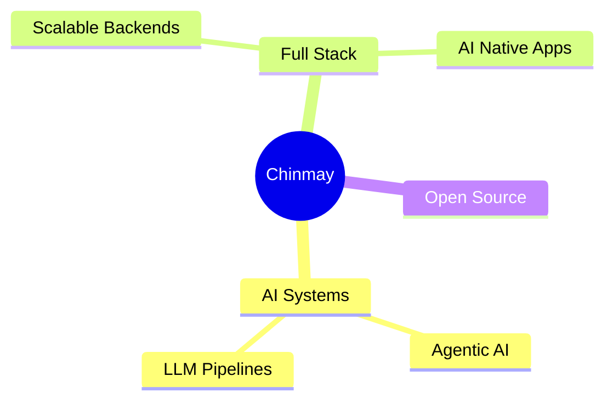

<div align="center">


# CHINMAY BHAT

### AI/ML Engineer • Full Stack Developer • Builder


</div>

---

## About

Building AI-powered systems and scalable software products.

Focused on:

- AI / ML Engineering
- Full Stack Development
- Intelligent Systems
- Open Source

Currently Building:

```txt
SAGAR v2 → AI marine intelligence platform
```

Open To:

```txt
Research • Collaboration • Engineering Opportunities
```

---

## Tech Stack

### AI / ML


### Development


### Data


---

## Featured Projects

### SAGAR

AI marine intelligence platform for aquatic species classification and migration prediction.

**Python • TensorFlow • FastAPI • Docker**

---

### Semantic Search Engine

Scalable semantic retrieval pipeline using embeddings, clustering, and vector search.

**Python • ChromaDB • FastAPI • Docker**

---

### HireFlow

Full-stack recruitment platform with role-based access and real-time recruitment pipelines.

**React • Firebase • Tailwind • Vite**

---
## Current Focus
 

 
---


<div align="center">


<br><br>


<br><br>


</div>

---

## Current Focus

```txt
→ Building AI-native products
→ Exploring Agentic AI systems
→ Scalable backend architecture
→ Applied ML research
```

---

## Connect

<div align="center">

[LinkedIn](https://linkedin.com/in/chinmay-bhat) •
[Email](mailto:yourmail@gmail.com) •
[GitHub](https://github.com/Chinmay0805)

</div>


